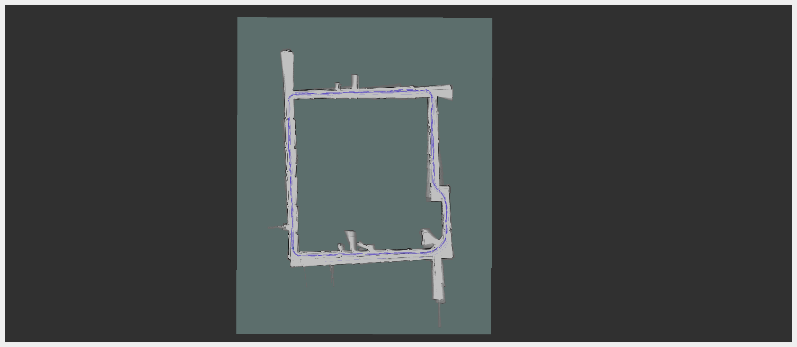

# Complete 2D Cartographer SLAM



## 简介

本项目实现一个完整的 2D Cartographer SLAM（同步定位与地图构建）系统，基于 ROS 2 框架。该系统能够通过激光雷达、编码器、IMU 数据生成环境地图，并实时定位机器人。


## 依赖

- ROS 2 Humble


## 安装

请按照以下步骤安装和配置项目：

1. **克隆项目**：
   ```bash
   git clone https://github.com/baller/ROS2_2D_Cartographer_Slam.git
   cd ROS2_2D_Cartographer_Slam
   ```

2. **设置 ROS 2 环境**：
   ```bash
   source /opt/ros/humble/setup.bash
   source /root/nav_ws/install/setup.bash
   ```

3. **构建项目**：
   ```bash
   colcon build
   ```

4. **运行示例**：
   ```bash
   ros2 run grid_map_generator imu_odom_laser_to_rosbag
   ros2 launch carto_slam_pkg slam.launch.py bag_path:=/root/nav_ws/output/fusion_robot_data.db3
   ```

5. **保存 SLAM 结果**：
   ```bash
   ros2 service call /finish_trajectory cartographer_ros_msgs/srv/FinishTrajectory "{trajectory_id: 0}"
   ros2 run nav2_map_server map_saver_cli -f /root/nav_ws/src/carto_slam_pkg/maps/nav2_map
   ```

## 使用示例

在运行上述命令后，系统将开始进行 SLAM 操作。你可以通过以下命令查看生成的地图：

```bash
ros2 run nav2_map_server map_saver_cli -f <map_file_name>
```

## 贡献

欢迎任何形式的贡献！
## 许可证

本项目采用 MIT 许可证，详细信息请查看 [LICENSE](LICENSE) 文件。

